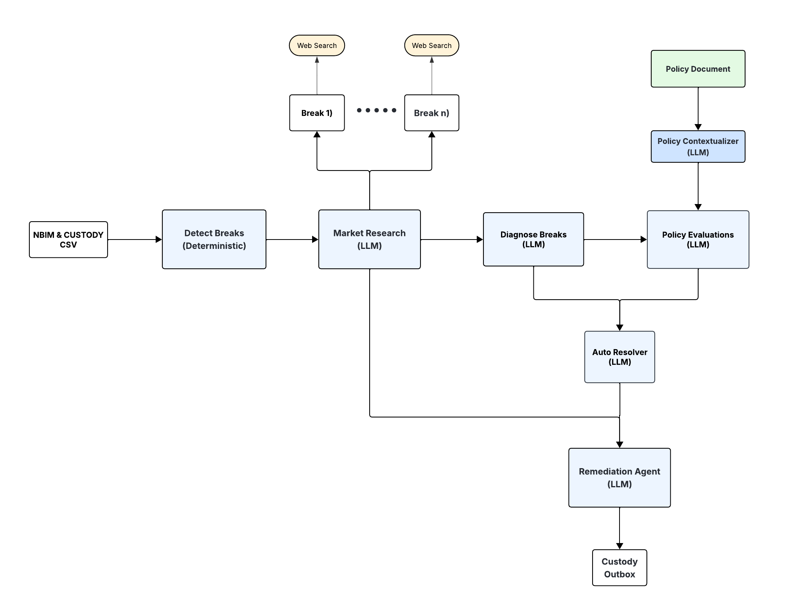

# Dividend Reconciliation Agent System

**AI-Powered Multi-Agent System for Financial Reconciliation**

A proof-of-concept demonstrating how LLMs can automate dividend reconciliation between internal systems and external custodians.

---

**5-Agent System** that automates the entire reconciliation workflow:



---

##  Agent Architecture

### Super Agent Initialization (Class)
```python
agent = Agent(market_model, break_model, policy_model, remediation_model, remediation_model, nbim_file, custody_file, policy)
```

---

### **Agent 1: Break Detection** (Deterministic)
**What it does:** Compares NBIM data vs Custodian data  

```python
breaks = agent.detect_breaks(nbim_file, custody_file)
```

---

### **Agent 2: Market Validation** (LLM + Web Search)
**What it does:** Searches public sources for official market data  

```python
market_facts = agent.market_validation(breaks, model="gpt-4o-nano")
```

---

### **Agent 3: Diagnosis** (LLM)
**What it does:** Classifies if error is internal (NBIM) or external (custodian)  

```python
diagnosis = agent.diagnose_breaks(breaks, market_facts, model="gpt-4.1-nano")
```

---

### **Agent 4: Policy Compliance** (LLM)
**What it does:** Checks breaks against tax treaties and company policy  

```python
policy_eval = agent.policy_evaluation(breaks, diagnosis, POLICY_TEXT, model="gpt-4.1-nano")
```


---

### **Agent 5: Auto-Resolution** (LLM + Deterministic Safeguards)
**What it does:** Decides if break can be auto-fixed or needs human review  

```python
resolution = agent.auto_resolutions(breaks, diagnosis, policy_eval, model="gpt-4.1-nano")
```


### **Agent 6: Remediation** (LLM)
**What it does:** Drafts messages and sends remediation suggestions to relevant Custodies outbox

```python
resolution = agent.auto_resolutions(breaks, diagnosis, policy_eval, model="gpt-4.1-nano")
```

## 🚀 Quick Start

```bash
pip3 install openai pandas python-docx
export OPENAI_API_KEY="key"

python3 Agent.py
```


## 📁 Project Structure

```
NBIM_Case/
├── Agent.py              
├── agents.py             
├── break_checks.py       
├── safeguards.py         
├── prompts.py            
├── dividend_policy.py    
├── data/                 
└── agent_output/         
```


